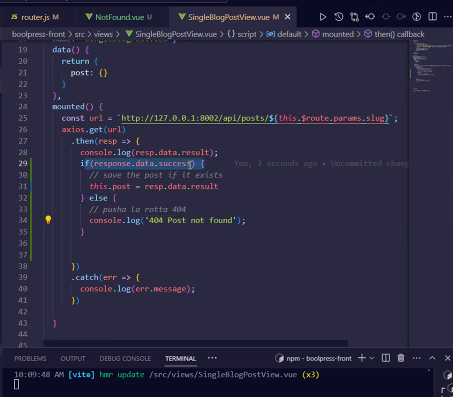

# DECOUPLING APP

### App backoffice
* API Endpoints
* PHP 
* MYSQL
* LARAVEL

- The thing that links everything up is HTTP-AJAX (Axios)

### App SPA (Single Page Application)
* VITE
* VUE
* Vue-route
* html
* css/scss
* js
* bootstrap 

# MONOLITH APP

### Front and back-end are together 
* API Endpoints
* PHP 
* MYSQL
* LARAVEL
* VITE
* VUE 3
* Vue-route v.4 
* html
* css/scss
* js
* bootstrap 


## How to use Vue-router

1. Front side (https://router.vuejs.org/guide/)
```
npm install vue-router@4

```

tanti router-link quanti sono i i link del menu di navigazione
<router-link to="/">Home</router-link>

l'attributo to è simile all'href 

2. Define some components with import

3. Define some routes


4. Create a new file
```router.js
import {createWebHashHistory, createRouter} from "vue-router";

const routes = [
    {path: '/', component: HomeView};
    {path:'/about', component: AboutView};
    {path:'/blog', component: BlogView};
    {path:'/contacts', component: ContactsView};
];

const router = createRouter({
    history: createWebHashHistory(),
    routes,
});

export {router} (this is called named export https://developer.mozilla.org/en-US/docs/web/javascript/reference/statements/export)

```
5. Then i import the router in main.js

```
import{router} from "./router.js";

createApp(app).use(router).mount('#app')

```
6. in src create a folder views in which we put the components

* HomeView.vue
* AboutView.vue
* BlogView.vue
* ContactsView.vue

7. Then import in router.js
```
import HomeView from "./views/HomeView.vue";
import AboutView from "./views/AboutView.vue";
import BlogView from "./views/BlogView.vue";
import ContactsView from "./views/ContactsView.vue";
```


8. 
Warning if doing posts.data.length it will not be an array so we trasform posts in null and then put in v-if only posts


# Errors

1. create a page called NotFound.vue in which you add an error message such as 404|PAGE NOT FOUND and a link to return to the first page

2. Then go to single project and implement the error with an if clause


3. Read and study https://router.vuejs.org/guide/essentials/navigation.html 
